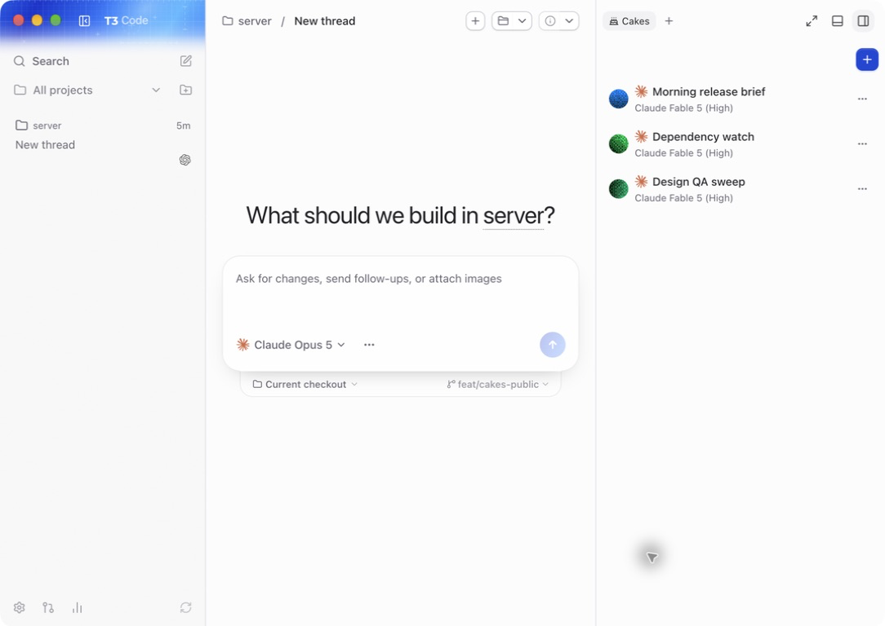
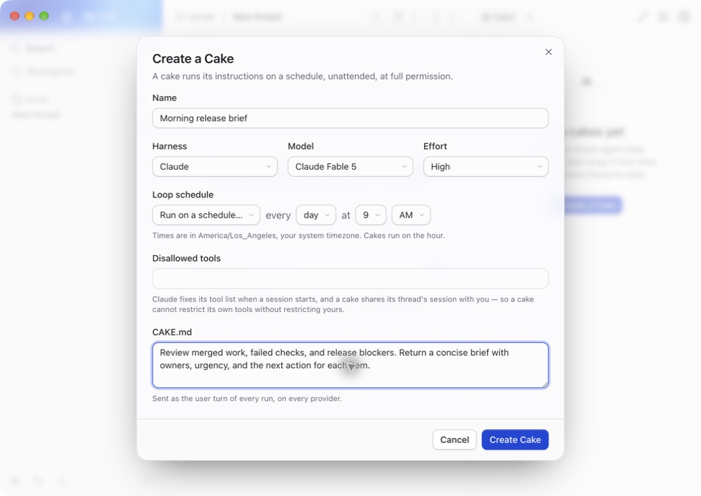
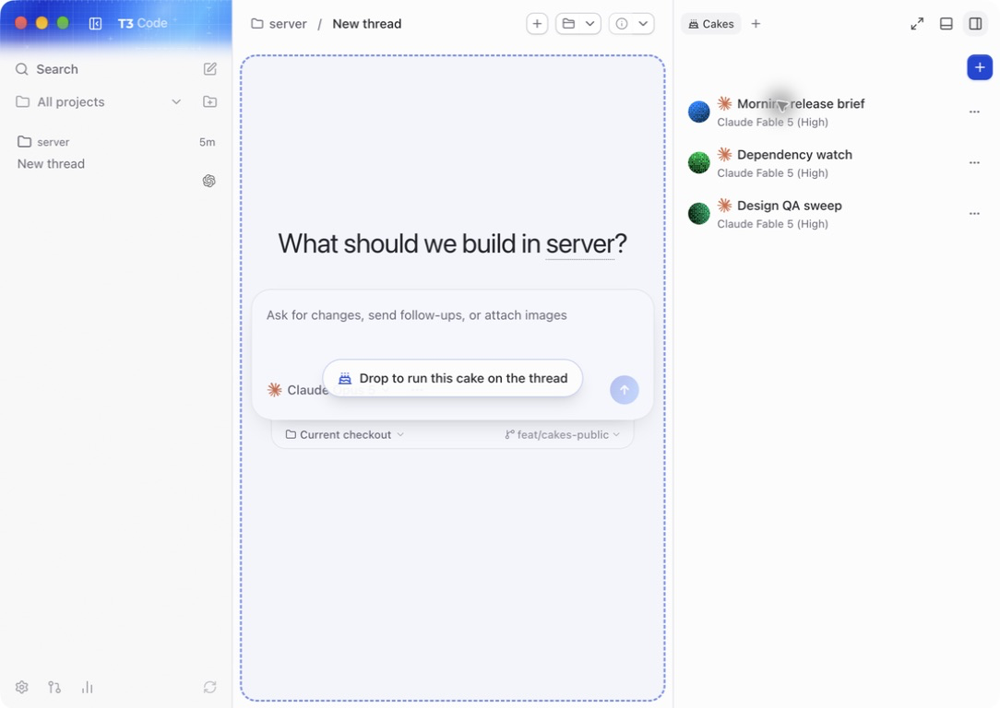

# t3code/cake-fork

This fork adds Cakes to T3 Code. A Cake is a saved agent loop with its own harness, model, effort level, schedule, and `CAKE.md` instructions. Create it once, keep it in the Cakes panel, and drag it onto a thread when you want it to run. Scheduled Cakes run unattended at full permission, so review their instructions before enabling a schedule.

<div align=center>

| Access Cakes, and their configuration via the right sidebar |
| - |
|  |

| Create Cakes scoped to the work, not the project |
| - |
|  |

| Drag and drop a Cake to start the loop, manage within prompt input |
| - |
 |

</div>

## Some mentions about Cakes

Cakes are just agent loops, as if you were to invoke `/loop` in your favorite harness.

Cake is literally me taking the "scheduled" and "routine" features from ChatGPT Desktop + Claude Desktop and throwing it into t3code, with a slight "twist".

### Why

I liked the idea of loops scoped to the task, project/dir, tools, frequency, etc... but didn't appreciate the tech debt for managing, and or interacting with those threads that were created.

During the development of Cake, it was a standalone app - everything worked, *sorta*.

*Truthfully I was having a tizzy with the streaming & so I wrote a big prompt to migrate and port the cake implementation into a forked ver. of t3code*

The same day I ported it over and started the refactor, Grok Bot came out - I still haven't played with it, so I have no clue how these two converge.

---

## Install Cake from source

> [!WARNING]
> Cake will never publish an npm package or desktop binary.
> `npx t3@latest`, the upstream T3 Code releases, and the T3 Code packages in Winget, Homebrew, and AUR do not include Cakes.

The current source runner requires macOS or Linux with Bash and Git. Install the [Vite+ CLI](https://viteplus.dev/guide/) first. Vite+ manages the project's Node.js runtime and package manager.

```bash
curl -fsSL https://vite.plus | bash
```

Then clone and run Cake:

```bash
git clone https://github.com/blas0/cake.git
cd cake
vp install
./scripts/cake-dev.sh
```

The Cake launcher stores its runtime state under the repository's `.t3` directory. 

It does not read or modify an installed T3 Code application's `~/.t3` data.

Cake supports Codex, Claude, Cursor, Grok Build, and OpenCode.

Authenticate as you would through t3code.

---

<div align=center>

If you do not have t3code, follow the authoring repo page: [pingdotgg/t3code](https://github.com/pingdotgg/t3code)

</div>
